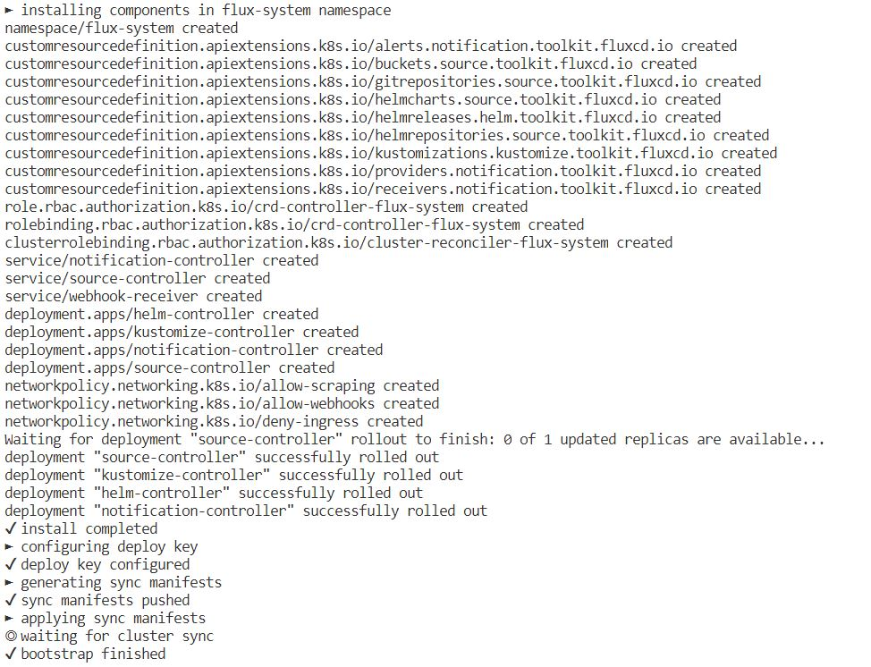
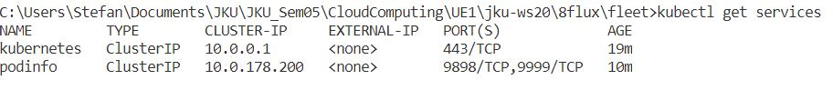

# JKU-CloudComputing-WS20_21 
Repository for the course Cloud Computing at the JKU in the winter semester 2020/2021

# Demo Application

Main Parts of Flux Demo:

https://github.com/paust/fleet.git  
https://github.com/paust/prod.git  
https://github.com/paust/stage.git  
https://github.com/paust/podinfo.git   
https://github.com/vfarcic/devops-toolkit.git  

## Fleet repo  

The fleet repo is responsible for the configuration of flux on the cluster. Here are the repos defined which should be watched, and which Kustomizations should be applied on the Cluster. 

## Podinfo  

The podinfo repo is a fork from https://github.com/stefanprodan/podinfo.git and adopted for our need to work with two environments.  
The Kusomization from the Fleet repo points to the desired Overlayfolder with the actual active Environment.

## devops-toolkit
The devops-toolkit repo is a demo application from Viktor Farcic where some helm releases are configured.

The prod and the stage repo are configuring the helm versions for the applications on the staging and production evnironments.
These two configuration repos only make sense where helm releases are used to deploy the applications.

## Versioning stragegies for podinfo and devops-toolkit applications

### devops-toolkit  
The devops-toolkit is versioned using helm charts. Which versioin sould be applied to the cluster is configured in the prod/stage repos. The versioning of the app is done in the demo app itself. Pro: the Versioning of the running app in the cluster does not infere the history of the app itself. Con: Each environment needs its own repo for configuration purposes.

### podinfo
 The podinfo applications uses Kustomizations to configure the cluster. The configuration files and the source files are in the same repo. So configuration and the application can not be modified independently. For eg using version 1.2 for the app and version 1.5 for the configuration.... 

# General Structure of the fleet repo
 
-  clusters/stage/flux-system/      generated Directory of the flux system by the bootstrapping process
-  clusters/stage/app_podinfo.yaml      Kustomization podinfo with the link to configurationpath from the repo_podinfo_source         
-  clusters/stage/repo_demo.yaml    ResoucePath to the demoapplication Repository
-  clusters/stage/repo_podinfo.yaml         ResoucePath to the podinfoapplication Repository
-  clusters/stage/repo-stage-source.yaml    ResoucePath to this repo itself   
-  clusters/stage/stage-kustomization.yaml   EntryPoint to the kustomization for the staging environment for the deomapplication 

The demoapplication configuration path:  
-> flux-system/kustomization.yaml -> stage-kustomization.yaml -> :stage: app_demo.yaml  

The podinfo configuration path:  
-> flux-system/kustomization.yaml -> app_podinfo.yaml -> :podinfo: /kustomize/app/env/stage/kustomization.yaml + overlay replica_count.yaml  

:stage: stage repo  
:podinfo: podinfo repo  

# Bootstrapping  

flux bootstrap github 
	--owner=$GITHUB_USER --repository=fleet
	--branch=main 
	--path=./clusters/stage
results in 

running pods 
kubectl get pods -n default  
  

kubectl get pods -n staging   

kubectl get services 
kubectl get pods -n staging   

